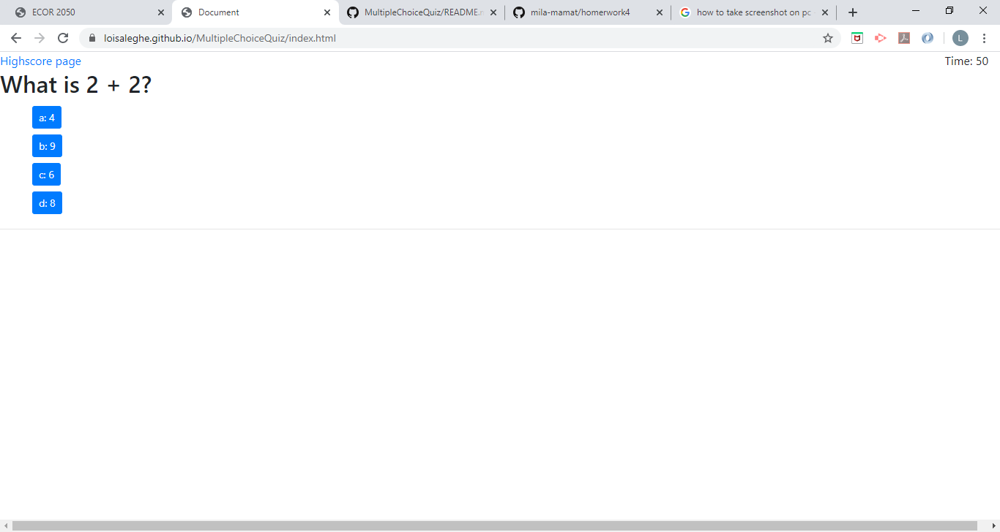
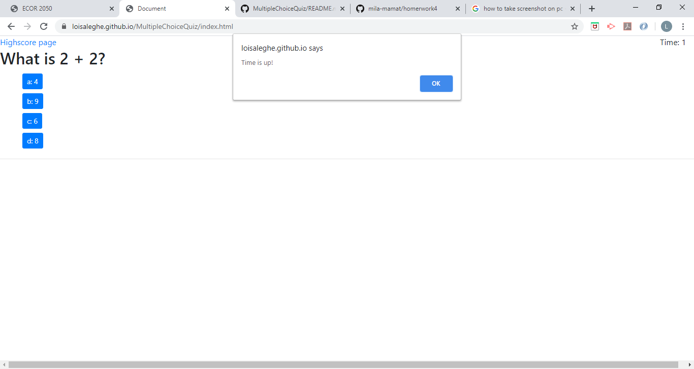
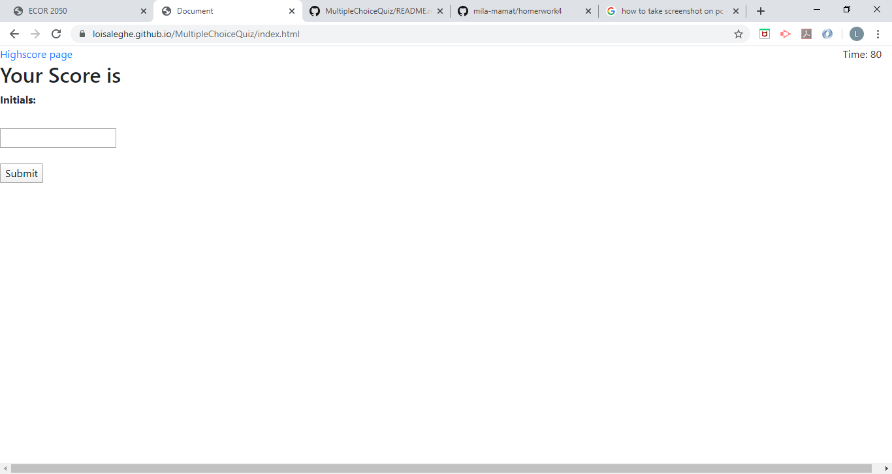
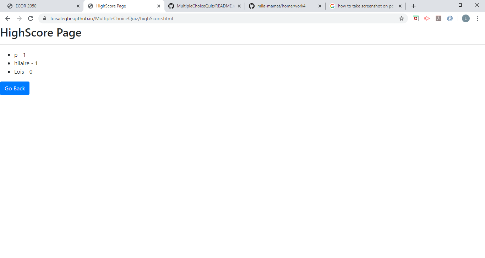

# MultipleChoiceQuiz
Build a multiple choice quiz that is timed 

```
## Details 
1. The Webpage should have a timer 
2. The timer should decrease by -5 if user enters the wrong answer 
3. The webpage should be responisive 
4. The quiz should end if user: 
   - does not end before the timer's up
   - clicks on the high score link 
   - Answers all questions
   
5. Should be able to see the highscore page when the user clicks the link
6. Should be able to view the scores of past attempts 
7. Should be only see the top 5 scores 


```
## Screenshots






## Final Output
https://loisaleghe.github.io/MultipleChoiceQuiz/.

